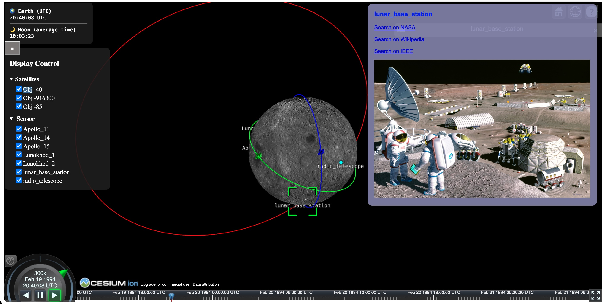
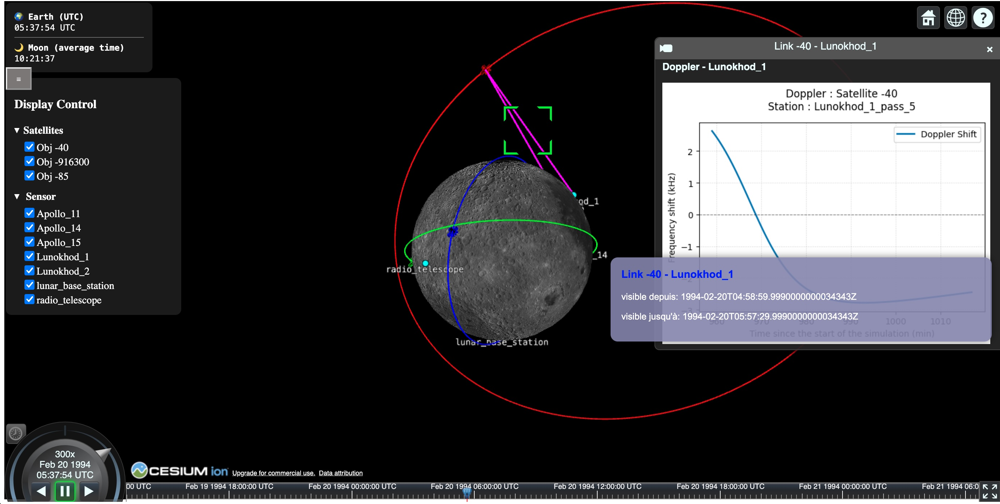

# Destination 🌑🌒🌔🌕 Moon 🌕🌖🌘🌑 - SeleNet 

SeleNet is a simulation platform for lunar IoT networks that uses SPICE-based orbital physics and a CesiumJS 3D interface to visualize satellites 🛰️, ground devices 👩‍🚀🧑‍🚀👨‍🚀🤖🤖🤖, and communication links 📡. It will help researchers 💭, teachers 🧑‍🏫 and students 🧑‍🎓 to model and evaluate the performance of lunar satellite constellations.  

## Quick run 

Follow the instruction on the orbit generator [Readme](orbit-generator/README_en.md), then the visualization app [Readme](visualization-app/README.md)

)
